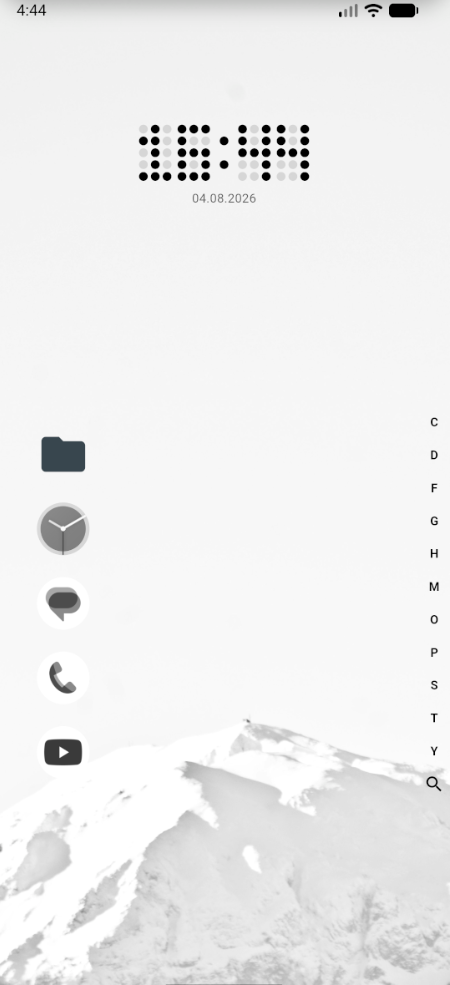
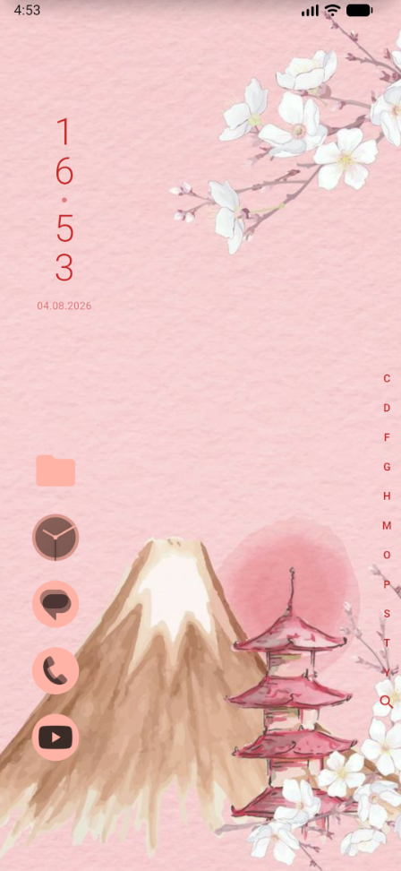
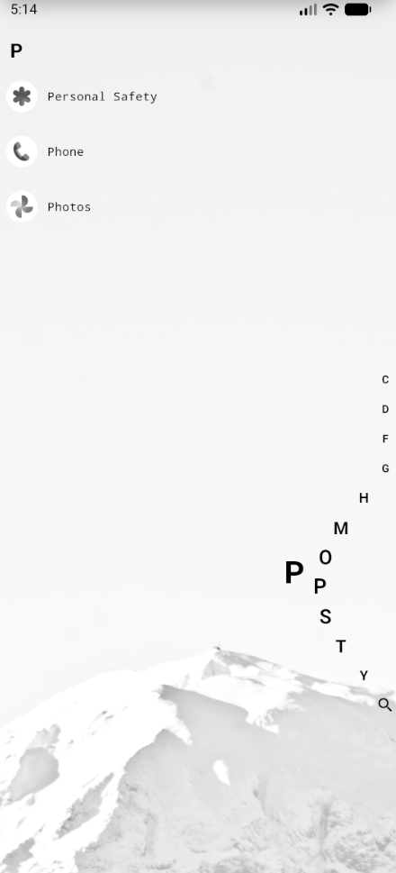
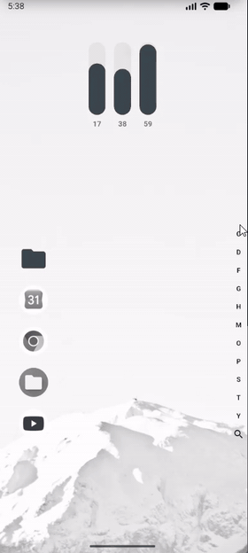
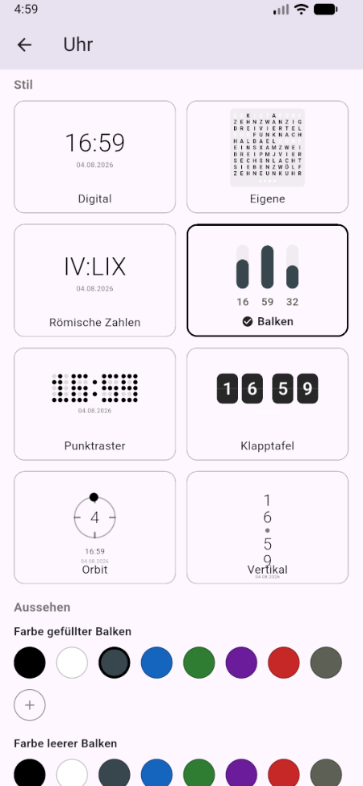
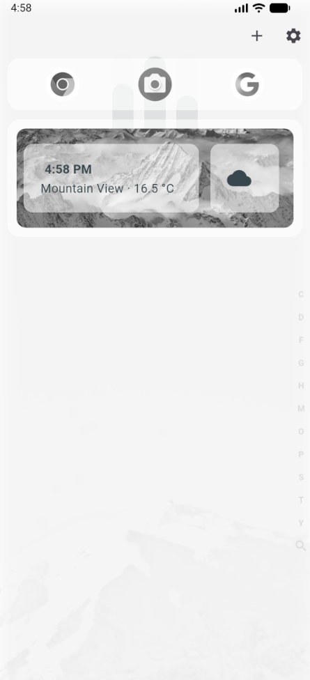
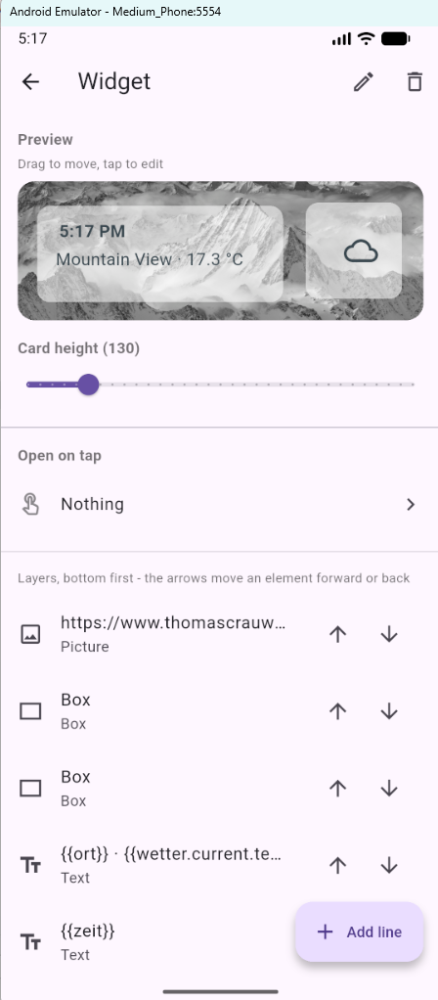

<p align="center">
  
</p>

<h1 align="center">hanneslauncher</h1>

<p align="center">A minimalist Android launcher, built with Flutter.</p>

**Quick Links:**
- [Download APK](#installation)
- [Report Issues](https://github.com/Hannes-swd/Hanneslauncher/issues)
  
No app grid, no pages to swipe through. The home screen is a clock, a few
pinned apps and a letter bar along the right edge, everything else sits
behind two gestures: **run your finger down the alphabet** for the app list,
**pull down from the top** for the panel with widgets, app rows and the
calendar.

<p align="center">
  
  
  
</p>

<p align="center">
  
  <br>
  <sub>Everything below, shown in one go.
  <a href="Images/showing.mp4">Full quality with sound</a>.</sub>
</p>

---

## Home screen

Wallpaper, clock, pinned apps, that is all there is, and every one of them
is optional.

**The letter bar on the right** only ever shows the letters that actually
hold something. Running a finger over one immediately reveals that letter's
apps, with no app drawer in between. Keep dragging to the left to pick a row
directly, launching an app in a single motion without ever lifting the
finger.

At the very bottom of the bar sits the **magnifier**: releasing there opens
a full text search across all apps, web apps and folders.

**Long-pressing a pinned icon** opens its quick actions, swap the icon, or
change the color of a folder, without the detour through the settings.

### Clock

Eight styles, each with its own colors, plus position, alignment and the
distance from the top:

<p align="center">
  
</p>

Digital · Custom word clock · Roman numerals · Bars · Dot matrix ·
Split-flap · Orbit · Vertical

---

## The panel

Pull down from the top edge of the screen. It follows the finger one to one
and is dismissed by the reverse of the gesture that opened it.

<p align="center">
  
  
</p>

The panel is made of **blocks**, which can be reordered freely:

| Block | What it shows |
|---|---|
| **App row** | 3–6 icons per line, names optional |
| **Widget** | A card you built yourself (see below) |
| **Calendar** | Events for the next few days, from the calendars already synced on the device. Tapping one opens it in the calendar app. |

Data sources, the calendar and the update check are only refreshed **when
the panel is opened**, a panel nobody pulls down costs no data at all.

---

## Building widgets

Widgets don't come from other apps, they are put together in the launcher
itself. A card is a stack of elements:

- **Text**, with `{{placeholders}}` in it
- **Icon**, switching by rule (`< 5 °C` → snowflake, `"Rain"` → cloud)
- **Image**, from a URL that may itself contain placeholders, which is how a
  map tile follows your current location
- **Box**, a plain rectangle; put behind text on a busy picture, it makes
  the text readable again
- **Action**, a button that fires an HTTP call (a smart home device on your
  own network, say), either fixed or as a toggle

Elements are placed by dragging them right in the preview, the layer list
below decides what sits in front of what. The card itself can open an app, a
web app or a folder when tapped.

### Placeholders

`{{zeit}}`, `{{datum}}`, `{{wochentag}}`, `{{ort}}` and the coordinates work
right away. Device values such as `{{akku}}`, `{{speicher_frei}}`,
`{{verbindung}}`, `{{sonnenauf}}`, `{{mondphase}}` or `{{schritte}}` come as
one package you can switch on.

Beyond that, **any JSON URL** can be added as a data source. Once it has
been tested successfully, every value in it is reachable by its path:

```
{{wetter.current.temperature_2m}}
{{wetter.daily.temperature_2m_max[0]}}
```

The full list is in **[PLACEHOLDERS.md](PLACEHOLDERS.md)**, and live in the
app under *Edit widget → tap an element → "Insert value"*.

---

## More features

- **Folders**, nestable to any depth, each with its own color
- **Web apps**: treat links and PWAs like apps, and pick per entry which
  browser they open in
- **Customize apps**: rename, set your own icon, uninstall
- **Icon design**: tint every icon the same color
- **App list**: font, size, line spacing, color, sort order
- **Language**: German or English, following the system language by default
- **Backup**: export every setting as JSON and read it back in
- **Update**: the app checks GitHub for new releases and installs the APK
  directly (see [RELEASE.md](RELEASE.md))
- **Settings search**: across every setting, in both languages at once, so
  typing German also finds the English terms

---

## Installation

Download a ready-made APK from the
[releases](https://github.com/Hannes-swd/Hanneslauncher/releases) and
install it. Then set it as the home app in Android once; the app helps with
that on first launch and also keeps it under *Settings → App → Default home
app*.

> **Before updating by hand:** Android only installs over an existing app if
> both are signed with the same key. If you ever do have to uninstall,
> **every setting is gone**, so export it under *Settings → App → Backup*
> first.

## Building it yourself

```powershell
flutter pub get
flutter run                  # to the connected device
flutter build apk --release  # build/app/outputs/flutter-apk/app-release.apk
```

Needs the Flutter SDK with Dart `^3.12.2`. A release including the GitHub
upload is one command, `.\tool\release.ps1 1.5.0`, details in
[RELEASE.md](RELEASE.md).

```powershell
flutter test      # tests
flutter analyze   # linter
```

## Permissions

All of them are optional; without one, exactly one feature is missing.

| Permission | What for |
|---|---|
| Internet | The widgets' data sources, the update check |
| Location (coarse) | `{{ort}}`, coordinates, sunrise/sunset |
| Read calendar | The calendar block on the panel |
| Network state | `{{verbindung}}` |
| Activity recognition | `{{schritte}}` |
| Usage access | `{{meistgenutzt}}` (granted by hand in the Android settings) |
| Install apps | Updating straight from the app |

## How it is put together

Plain Flutter, no state management package: every area has a singleton
`ValueNotifier` controller (`*_controller.dart`) keeping its state in
`SharedPreferences`. What Flutter can't do itself, the app list, the
calendar, device sensors, excluding the screen edge from the system
gestures, runs through method channels in
`android/app/src/main/kotlin/.../MainActivity.kt`.

| File | Contents |
|---|---|
| [PLACEHOLDERS.md](PLACEHOLDERS.md) | Every widget placeholder |
| [RELEASE.md](RELEASE.md) | Bump the version, build, publish on GitHub |

---

<sub>Note: parts of this project, including this documentation, were written
with the help of AI.</sub>
